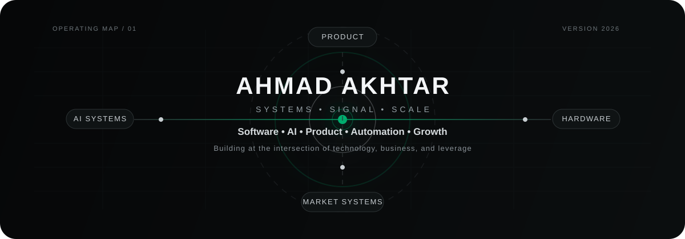
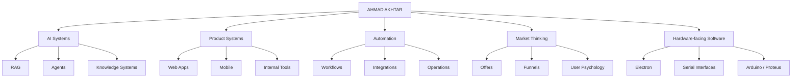

<div align="center">
  
</div>

<div align="center">

[LinkedIn](https://www.linkedin.com/in/prodigy2005/) • [Email](mailto:mrahmadakhtar@gmail.com)

</div>

---

## / position

I operate at the intersection of **software, AI, product, automation, and market systems**.

I am not interested in living inside one box.
I like building things that create **leverage** — products, workflows, interfaces, engines, and systems that move beyond code for code's sake.

If most programmers think in features, I prefer thinking in **systems**:

- what is being built
- who it moves for
- how it scales
- how it sells
- how it compounds

The pinned repositories below are the proof.

---

## / operating map



---

## / what makes me different

### 01 — I bridge worlds
Most people stay in one lane.
I’m interested in the edges where lanes meet:
**technology × business**, **product × marketing**, **software × real-world systems**.

### 02 — I care about signal
I dislike bloat, noise, and ornamental complexity.
The goal is clean systems, strong positioning, and useful products with real leverage.

### 03 — I build like an operator
I don't look at software as isolated code.
I look at it as distribution, interface, workflow, positioning, user movement, and business consequence.

---

## / current zones

```text
AI systems         → RAG, knowledge agents, applied intelligence
Product            → full-stack software, UX, interfaces, shipping
Automation         → workflow design, integrations, internal ops
Growth             → offers, funnel logic, user understanding
Systems thinking   → leverage, architecture, compounding decisions
```

---

## / build philosophy

- **Signal > noise**
- **Leverage > busywork**
- **Systems > isolated features**
- **Taste matters**
- **Good products are technical and commercial at the same time**
- **A generalist with depth beats a siloed specialist when the goal is building complete outcomes**

---

## / now

Right now I’m focused on building software that feels like an unfair advantage:
AI-native products, internal systems, intelligent workflows, and interfaces that make complex things feel sharp, clean, and powerful.

If you're here, you're probably looking at the pinned work below.
That's where the receipts are.

---

<div align="center">

**Software. Systems. Signal.**

</div>