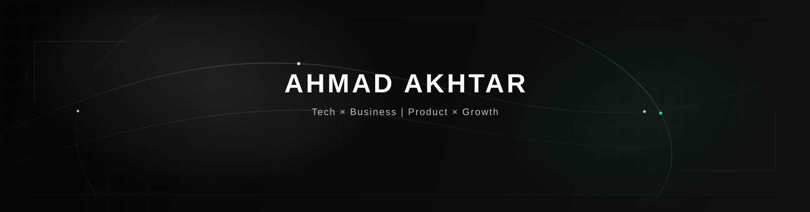

 

 

## The Thesis

A technically perfect product can still disappear.

It can solve the wrong problem. It can be positioned badly. It can confuse the person it was built for. It can ship without distribution. It can automate a process nobody should have been doing in the first place.

That is why I never wanted to become *just* a programmer.

I learned to care about the entire chain:

**the problem → the system → the product → the message → the market → the outcome.**

Code sits inside that chain. So do design, automation, positioning, persuasion, sales, and user psychology.

The interesting work happens when they stop being separate disciplines.

> **Code makes it work. Product makes it useful. Words make it understood. Distribution makes it matter.**

That intersection is where I like to build.

---

## Operating Range

<table align="center">
<tr>
<td align="center" width="50%">

### TECHNOLOGY

AI systems · full-stack software  
RAG · APIs · data · automation  
hardware-facing interfaces

</td>
<td align="center" width="50%">

### PRODUCT

UX · systems architecture · shipping  
turning ambiguous problems into  
products people can actually use

</td>
</tr>
<tr>
<td align="center" width="50%">

### BUSINESS

Offers · monetization · operations  
commercial thinking · systems leverage  
building beyond the feature list

</td>
<td align="center" width="50%">

### GROWTH & COPY

Positioning · persuasive writing · funnels  
user psychology · content · distribution  
turning attention into movement

</td>
</tr>
</table>

 

## The Common Thread

At first glance, writing software, designing an offer, building a funnel, wiring an Arduino, architecting a RAG pipeline, and writing a page that keeps someone reading look like unrelated skills.

I don't see them that way.

They are all forms of **systems design**.

A backend moves data.  
A product moves a user.  
A workflow moves information.  
A piece of copy moves attention.  
A business moves value.

Different medium. Same question:

**What has to happen next — and how do we make that transition inevitable?**

That question is probably the closest thing I have to a specialty.

---

## How I Build

I like products that feel obvious *after* they exist.

That usually means doing the difficult thinking before the interface gets polished:

- finding the actual constraint instead of decorating the symptom
- reducing complexity until every moving part earns its place
- grounding AI in real data instead of pretending a model knows everything
- treating positioning and distribution as product decisions, not post-launch chores
- writing interfaces and messages so the next action feels natural
- building repeatable systems instead of one-off demos
- using automation for leverage, not for the sake of saying something is automated
- keeping enough taste in the loop that technically correct does not become visually forgettable

I am interested in the layer above implementation: **why this should exist, why someone should care, and why this architecture is the right way to make it real.**

---

## Stack

 

## What I'm Exploring Now

`AI-native products` · `knowledge systems` · `agents & automation` · `productized software`

`human-computer interfaces` · `distribution` · `persuasion` · `business systems`

I am less interested in adding another framework to the list than I am in understanding how the pieces combine into something with disproportionate upside.

The pinned repositories are snapshots of that process.

---

## Principles

`Signal > noise` · `Systems > features` · `Leverage > busywork` · `Taste matters`

`Distribution is part of the product` · `Complexity must earn its place` · `Build things that move`

 

 

<picture>
  <source media="(prefers-color-scheme: dark)" srcset="https://github.pumbas.net/api/contributions/AhmadAkhtar007?colour=C0C0C0&bgColour=0D0D0D#gh-dark-mode-only" />
  
</picture>

 

### Build with intent. Compound with discipline.

The goal was never to fit neatly inside one box.

